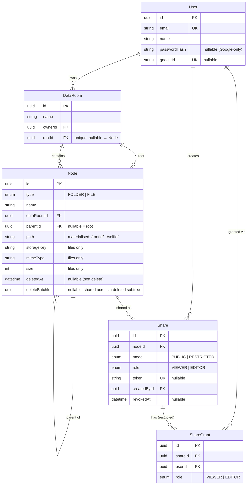

# Data Room — MVP

A full-stack **virtual Data Room**: an organized, secure repository for storing and
sharing documents (think Google Drive / Dropbox scoped to a single "drive"). Built
for the take-home brief — folders, files, and granular sharing, working end to end
against a real database and blob storage.

- **Frontend:** React + TypeScript + Vite + Tailwind + TanStack Query
- **Backend:** NestJS (Node) + Prisma + PostgreSQL
- **Storage:** pluggable blob storage (local disk in dev; S3-compatible in prod)
- **Auth:** email + password **or Google sign-in**, both issuing the app's own JWT

> **Live:** _frontend_ → `<VERCEL_URL>` · _API_ → `<RENDER_URL>/api`
> (fill in after deploy — see [Deployment](#deployment)). Demo login:
> `demo@dataroom.dev` / `password123`.

---

## Table of contents

- [Features](#features)
- [Architecture at a glance](#architecture-at-a-glance)
- [Quick start (local)](#quick-start-local)
- [Environment variables](#environment-variables)
- [Project structure](#project-structure)
- [Data model / ERD](#data-model--erd)
- [Design decisions — the eight load-bearing ones](#design-decisions--the-eight-load-bearing-ones)
- [How it scales](#how-it-scales)
- [Authorization, proven by refusals](#authorization-proven-by-refusals)
- [Edge cases handled](#edge-cases-handled)
- [API overview](#api-overview)
- [Testing & security](#testing--security)
- [Deployment](#deployment)
- [Known limitations](#known-limitations)
- [Where I used AI](#where-i-used-ai)
- [Trade-offs & future work](#trade-offs--future-work)

---

## Features

**Folders & files (one tree)**
- Create folders and nest them arbitrarily deep; browse with **breadcrumbs**
- Upload files (multiple at once, **drag-and-drop**, **per-file progress**)
- View files inline (PDF / image preview, **auth-protected — no public blob URL**)
- Rename, **move** (folder picker), and delete either folders or files
- Deleting a folder shows a **warning with the exact file/subfolder counts** and how
  many active share links it will break — then soft-deletes the whole subtree as a unit
- Name clashes inside a folder are resolved by **strategy**: auto-suffix `name (1)`,
  **replace** (keeps the old as a soft-deleted version), or a **typed `409`** so the UI
  can ask the user

**Search** files and folders by name across a whole Data Room (case-insensitive,
trigram-indexed, keyset-paginated).

**Sharing**
- Share a **Data Room**, a **folder**, or a **single file** — recipients get
  **read-only** access to that node *and everything nested beneath it*
- Two modes: **public link** (anyone with the link) and **restricted** (only granted users)
- Owner can **revoke** at any time; revocation takes effect on the next request

**Auth** — register / login with email + password, **or Sign in with Google**. A Data
Room belongs to its owner and is invisible to everyone else unless shared.

---

## Architecture at a glance

The whole app is built on **one idea repeated**: a folder and a file are the same row.

- **One table, `Node`,** with a `type` discriminator (`FOLDER` / `FILE`). Listing,
  breadcrumbs, move, delete, search, and authorization are each written **once** and
  work for both.
- **A materialised `path`** (`/rootId/…/selfId/`) on every node. A subtree is
  `path LIKE node.path || '%'`; ancestors are parsed straight from the path into an
  indexed `id IN (…)` lookup. No recursive CTEs, no N+1 walks.
- **One authorization seam.** `AccessService.levelFor(user, node)` returns a rank on a
  ladder (`NONE < VIEWER < EDITOR < OWNER`); `require(user, node, min)` enforces it.
  Both the owner API and the public consumer API route through the *same* function.
- **Sharing a room = sharing its root node.** `DataRoom.rootId` points at a real
  `Node`, so "share this room" and "share this folder" are one code path.

Everything else (soft-delete batches, the name-uniqueness DB constraint, the storage
interface) hangs off these. See [Design decisions](#design-decisions--the-eight-load-bearing-ones).

---

## Quick start (local)

**Prerequisites:** Node 18+, Docker (for PostgreSQL). No local Postgres needed.

```bash
# 1) Start PostgreSQL (docker-compose maps it to localhost:5433)
docker compose up -d

# 2) Backend
cd backend
cp .env.example .env            # defaults already point at the docker DB
npm install
npx prisma migrate dev          # apply schema + the partial-unique-index migration
npm run db:seed                 # optional demo data: demo@dataroom.dev / password123
npm run start:dev               # API on http://localhost:3000/api

# 3) Frontend (new terminal)
cd UI
cp .env.example .env            # VITE_API_URL=http://localhost:3000/api
npm install
npm run dev                     # app on http://localhost:5173
```

Open http://localhost:5173, register, and create your first Data Room.

> Uploaded blobs are written to `backend/storage/` in dev (gitignored).

---

## Environment variables

**Backend (`backend/.env`)**

| Var | Purpose | Default |
| --- | --- | --- |
| `DATABASE_URL` | Postgres connection string | docker DB on `localhost:5433` |
| `JWT_SECRET` | Token signing secret — **required**; the app fails fast at boot if unset | _(no default)_ |
| `JWT_EXPIRES_IN` | Token lifetime | `7d` |
| `GOOGLE_CLIENT_ID` | Google OAuth Web Client ID (empty = Google sign-in off) | `""` |
| `PORT` | API port | `3000` |
| `CORS_ORIGIN` | Allowed web origin(s), comma-separated (any `*.vercel.app` also allowed) | `http://localhost:5173` |
| `APP_URL` | Base URL used to build share links | falls back to `CORS_ORIGIN` |
| `STORAGE_DRIVER` | `local` or `s3` | `local` |
| `STORAGE_LOCAL_DIR` | Where local blobs go | `./storage` |
| `MAX_FILE_SIZE_MB` | Per-file upload limit | `50` |
| `AUTH_THROTTLE_LIMIT` | Credential-endpoint rate limit / min / IP (raised in tests) | `10` |

**Frontend (`UI/.env`)**

| Var | Purpose | Default |
| --- | --- | --- |
| `VITE_API_URL` | Backend API base URL | `http://localhost:3000/api` |
| `VITE_GOOGLE_CLIENT_ID` | Same Google Web Client ID (empty = button hidden) | `""` |

### Enabling Google sign-in

1. In **Google Cloud Console → APIs & Services → Credentials**, create an **OAuth
   client ID** of type **Web application**.
2. Add your app origins under **Authorized JavaScript origins** (e.g.
   `http://localhost:5173` for dev, plus your deployed frontend URL).
3. Put the Client ID in **both** `backend/.env` (`GOOGLE_CLIENT_ID`) and `UI/.env`
   (`VITE_GOOGLE_CLIENT_ID`), then restart both dev servers.

The backend verifies the Google **ID token** with `google-auth-library` (checking the
audience matches the Client ID), find-or-creates the user by `googleId` (falling back to
email so an existing password account gets Google linked), and issues the app's own JWT.
When the Client ID is unset the button is hidden and email/password still works.

---

## Project structure

```
GS1/
├─ docker-compose.yml            # PostgreSQL for local dev (→ localhost:5433)
├─ backend/                      # NestJS API
│  ├─ prisma/
│  │  ├─ schema.prisma           # the unified Node data model
│  │  └─ migrations/             # incl. the manual partial-unique-index migration
│  └─ src/
│     ├─ auth/                   # JWT email/password + Google; optional-auth guard
│     ├─ common/                 # AccessService (the one seam), node-path helpers, cursor
│     ├─ storage/                # StorageService interface (local disk / S3 + presign)
│     ├─ nodes/                  # the core: folders+files CRUD, move, upload, search
│     ├─ data-rooms/             # room = root node; list/stats aggregate over Node
│     └─ sharing/                # share management + read-only consumer API
└─ UI/                           # React app
   └─ src/
      ├─ lib/                    # typed API client, discriminated Entry types, formatters
      ├─ context/               # auth context
      ├─ hooks/                  # server-state (TanStack Query) + upload/drop hooks
      ├─ components/            # table, dialogs, viewer, toolbar…
      └─ pages/                 # Login, Register, Rooms, Room browser, Shared view
```

---

## Data model / ERD

**One `Node` table** for folders and files, carrying a **materialised `path`**. A
`DataRoom` points at its **root node**. A `Share` targets any `Node`; a shared node
implicitly covers its whole subtree.



**Key indexes**
- `Node(dataRoomId, parentId)` — direct-children listing
- `Node(dataRoomId, name)` and a **GIN `pg_trgm`** index on `Node(name)` — search
- `Node(path)` — subtree (`LIKE path || '%'`) and ancestor lookups
- `Node(deleteBatchId)` — restore / preview a deleted subtree as a unit
- **Partial, case-insensitive unique** `("parentId", lower("name")) WHERE "deletedAt" IS NULL`
  — name uniqueness enforced by the database, not by application read-then-write
- unique `Share.token`, unique `ShareGrant(shareId, userId)`

> Prisma can't express a partial/functional unique index, so it lives in a **hand-written
> migration** (`prisma/migrations/*_node_name_unique`) that runs with the rest.

---

## Design decisions — the eight load-bearing ones

1. **One `Node` table, not `Folder` + `File`.** A discriminator (`type`) means listing,
   breadcrumbs, move, delete, search, and authorization are written once. Half the
   endpoints and half the bugs disappear because there's no "and also for files" branch.

2. **Materialised `path` over an adjacency list + recursive CTE.** Every node stores
   `/rootId/…/selfId/` (leading **and** trailing slash so `/a/1/` can't prefix-match
   `/a/12/`). Subtree = one indexed `LIKE`; ancestors are parsed from the string into an
   `id IN (…)` lookup. A **move** rewrites the path prefix of the subtree in a single
   SQL `UPDATE`. Trees are shallow, so paths stay short and reads stay indexed.

3. **A room *is* its root node** (`DataRoom.rootId → Node`). "Share this room" and
   "share this folder" collapse into one path: you share a node. Room creation makes the
   room and its root in one `$transaction`.

4. **One authorization seam with a ranked ladder.** `levelFor(user, node)` = the max of
   room-ownership and any active share covering the node or an ancestor, mapped onto
   `NONE < VIEWER < EDITOR < OWNER`; `require(user, node, min)` compares ranks. The owner
   API and the token consumer API both go through it — there is exactly one place access
   is decided. Adding editors later is raising a `min`, not new plumbing.

5. **Name uniqueness is a database constraint, surfaced as a typed `409`.** A partial,
   case-insensitive unique index guarantees no two live siblings share a name even under
   a race. Writes attempt the insert and handle the `P2002` violation by **strategy**:
   `rename` (auto-suffix), `replace` (soft-delete the old row — free versioning), or
   `error` → `{ code: "NAME_CONFLICT" }` for the UI. This is the inverse of the common
   read-then-write approach, which races.

6. **Soft delete with a shared `deleteBatchId`.** Deleting a subtree stamps every node
   with one batch id and a `deletedAt`. That makes delete previews, "restore this exact
   delete", and trash all trivial, and it's why a link to just-deleted content returns a
   clean `404` instead of a `500`.

7. **One HTTP request per file on upload.** Each file is its own request, so the client
   shows independent per-file progress and can retry or cancel one without touching the
   others — instead of an all-or-nothing multipart batch.

8. **Storage behind a three-method interface** (`put` / `getStream` / `getSignedUrl`).
   Dev uses local disk (`getSignedUrl` → `null`, so the API streams bytes); prod swaps in
   S3, where `getSignedUrl` presigns and file bytes can bypass the API entirely. No
   business logic changes between the two.

**On the frontend**, the mirror of the seam is: **server state lives in TanStack Query**
(rooms, listings, shares — cached, invalidated on mutation) and **client state is local**
(dialogs, selection, upload progress); the API returns a **discriminated `Entry` union**
so `entry.type` narrows folder vs file in the UI exactly as it does in the DB; and errors
are **typed by code** (`apiErrorCode` reads `NAME_CONFLICT`) rather than string-matched.

---

## How it scales

**1) Total size & item count of a folder including its whole subtree.**
One indexed query over the materialised path — no recursion:

```sql
SELECT
  count(*) FILTER (WHERE type = 'FOLDER')            AS folder_count,
  count(*) FILTER (WHERE type = 'FILE')              AS file_count,
  COALESCE(sum(size), 0)                             AS total_size
FROM "Node"
WHERE "path" LIKE $1 || '%'      -- $1 = folder.path, e.g. '/root/legal/'
  AND "deletedAt" IS NULL
  AND id <> $2;                  -- exclude the folder itself
```

Backed by the `Node(path)` index. For a **whole room** it's cheaper still — `WHERE
"dataRoomId" = $1` — because `dataRoomId` is denormalised onto every node. If subtree
stats ever become a hot path on huge trees, the next step is **maintained counter
caches** (per-folder `fileCount` / `totalSize` updated transactionally on write),
turning the read into an O(1) lookup.

**2) What changes when one Data Room holds 100,000 files.**
- **Listing is per-folder**, keyed on `Node(dataRoomId, parentId)` — a view reads one
  folder's direct children, bounded regardless of room size.
- **Keyset (seek) pagination** (`common/cursor.ts`): the query seeks
  `WHERE (name, id) > (:lastName, :lastId) ORDER BY name, id LIMIT n`, folders phased
  before files, so deep pages stay flat instead of degrading like `OFFSET`. The client
  (`useListing` + `InfiniteSentinel`) turns cursors into infinite scroll.
- **Subtree stats are never computed in list views** — fetched lazily via the path query
  only for `delete-preview` and room cards.
- **Search** is a `pg_trgm` **GIN** index on `Node(name)`, scoped by `dataRoomId` and
  keyset-paginated, so `name ILIKE '%q%'` stays fast.
- **Blob serving** already has the seam to move to **presigned S3 URLs + CDN**
  (`getSignedUrl`), so bytes never stream through the API at scale.

**3) Extending sharing to per-user roles (viewer/editor) without remodeling.**
The ladder already ranks `EDITOR` above `VIEWER`, and `ShareRole` / `ShareGrant.role`
already carry the enum — the MVP simply never issues `EDITOR`. Turning it on is an
**authorization-layer** change: the write endpoints `require(..., Level.EDITOR)` and a
granted editor passes; public links stay viewer-only by definition. **No migration**,
because the seam and the schema were built for it from the start.

---

## Authorization, proven by refusals

Happy paths don't prove an access model — the refusals do. The e2e suite
(`backend/test/app.e2e-spec.ts`) drives **four actors** (owner, an invited VIEWER, an
authenticated outsider, an anonymous visitor) through the ones that matter:

| Scenario | Expected |
| --- | --- |
| Authenticated **outsider** hits a node they have no access to | **`404`** — existence is hidden (not `403`, not an empty list) |
| **Invited VIEWER** tries to rename / move / delete | **`403`** — visible, but read-only |
| **Anonymous** public link asks for a folder **above** the shared node | **`404`** — can't climb out of the shared subtree |
| Owner **revokes** a share | the grantee's **next** request is `404` — no relogin needed |
| A link points at **just-deleted** content | clean **`404`**, never a `500` |

The distinction is deliberate: `NONE` level → `404` for an authenticated caller (don't
leak that the node exists) or `401` for an anonymous one (logging in *might* grant
access); a caller who can see the node but lacks the level → `403`.

---

## Edge cases handled

- **Duplicate names** on create / upload / rename / move → DB-enforced; resolved by the
  chosen strategy (suffix / replace-as-version / typed `409`).
- **Deleting a folder** previews the exact **file/subfolder counts and active links**
  affected, then soft-deletes the subtree as one `deleteBatchId`.
- **Deleting a shared item / revoking a link** → the consumer view shows a clean
  "link not found / revoked" state.
- **Restricted link, not logged in** → prompted to sign in and returned to the link;
  **logged in without a grant** → explicit "no access".
- **Share scoping** — a folder share never leaks parents: breadcrumbs are relative to the
  shared root, and every node is verified *within* the shared subtree via its path.
- **Moving a folder into its own subtree** is rejected (cycle guard); cross-room moves are
  rejected.
- **Upload validation** — per-file size cap (`MAX_FILE_SIZE_MB`) and **magic-byte sniffing**
  so a `.pdf` that isn't a PDF is rejected on its bytes, not its declared type.

---

## API overview

All owner routes require `Authorization: Bearer <token>`. The tree lives under `/nodes`.

| Method | Route | Purpose |
| --- | --- | --- |
| POST | `/api/auth/register` · `/login` · `/google` | auth; returns `{ accessToken, user }` |
| GET | `/api/auth/me` | current user |
| GET/POST | `/api/data-rooms` | list (single-query stats) / create room (+ root) |
| GET/PATCH/DELETE | `/api/data-rooms/:id` | room detail / rename / delete |
| GET | `/api/nodes/root?dataRoomId=&cursor=&limit=` | room root listing (folders-first) |
| GET | `/api/nodes/:id/children?cursor=&limit=` | paginated listing + breadcrumb |
| GET | `/api/nodes/search?dataRoomId=&q=&cursor=` | name search across a room |
| GET | `/api/nodes/:id/delete-preview` · `/content` | affected counts+links · inline bytes |
| POST | `/api/nodes/folders` | create folder (`onConflict` strategy) |
| POST | `/api/nodes/upload` | multipart upload, one request per file, type/size checked |
| PATCH | `/api/nodes/:id` · `/:id/move` | rename · move (both take `onConflict`) |
| DELETE | `/api/nodes/:id` | soft-delete subtree |
| POST/GET/DELETE | `/api/shares…` | create / list / revoke shares, manage grants |
| GET | `/api/shared/:token` · `/browse` · `/files/:id/content` | **read-only** consumer access |

---

## Testing & security

- **End-to-end tests** (`backend/test/app.e2e-spec.ts`, `npm run test:e2e`) run against a
  live Postgres and cover auth, tree CRUD, **name-conflict** (auto-resolve + typed `409`),
  **folders-first keyset pagination**, **search**, **move + cycle guard**, **soft-delete**,
  the full **sharing access model**, and the **negative authorization matrix** above.
- **Security:** `helmet` headers; **rate limiting** (120 req/min globally, tighter on
  credential endpoints) via `@nestjs/throttler`; **upload validation** (size cap + magic-byte
  sniff); DTO validation with `whitelist + forbidNonWhitelisted`; a **global exception
  filter** returning a consistent JSON envelope (preserving typed error codes) without
  leaking internals. Files are served `Content-Disposition: inline` **behind auth**; the
  client fetches the blob with its token and renders it via an object URL, so protected
  PDFs never need a public URL.

```bash
cd backend && npm run test:e2e
```

## Deployment

Both tiers are stateless (blobs live in object storage), so any Node host works. The
reference deploy is **Vercel (frontend) + Render (backend) + Neon (Postgres)**.

**Database** — a managed Postgres (Neon / Supabase / RDS). Run `npx prisma migrate deploy`
on release; it applies the schema **and** the hand-written partial-unique-index migration.

**Blob storage** — set `STORAGE_DRIVER=s3` and provide the `S3_*` vars from `.env.example`.
Local disk is dev-only (Render's filesystem is ephemeral), so a real deploy should use S3.
To exercise the S3 path locally, `docker compose up -d minio` starts an S3-compatible
MinIO (console at `http://localhost:9001`, `minioadmin`/`minioadmin`); create a bucket and
point the `S3_*` vars at `http://localhost:9000` with `S3_FORCE_PATH_STYLE=true`.

**Backend (Render)** — build `npm ci && npm run build`, start `node dist/main.js`, set env
vars, point `CORS_ORIGIN` + `APP_URL` at the frontend domain. (Any `*.vercel.app` origin is
also accepted so preview deploys work; lock this to a fixed domain for a single-frontend prod.)

**Frontend (Vercel)** — Vite bakes `VITE_*` at **build** time, so set `VITE_API_URL`
(and `VITE_GOOGLE_CLIENT_ID`) before building; output `dist/`, with an SPA rewrite so all
routes serve `index.html`.

> A `docker-compose.yml` is included for local Postgres; production uses managed services.

---

## Known limitations

Deliberately scoped for the MVP and called out here rather than hidden — each has a clear
remediation path:

- **Uploads are buffered in memory.** `multer` holds each request's file in RAM before it
  reaches storage. Fine for the demo; the production fix is to stream multipart parts
  straight to disk/S3.
- **Filename search doesn't escape `LIKE` metacharacters.** Searching `50%` or `a_b` treats
  `%`/`_` as wildcards — wrong results, not injection (queries are parameterized). Fix:
  escape the term or use a trigram-similarity (`%`) query.
- **Subtree deletes fan out unbounded** at the blob layer. Deleting a large subtree issues
  one blob delete per file; batching (or S3 `DeleteObjects`) would bound it. The DB side is
  already one operation (a single soft-delete `UPDATE` over the path).
- **Optional-auth on the public share surface treats an invalid/expired token as anonymous**
  (rather than erroring), intentionally, so a stale browser token never blocks a genuinely
  public link — at the cost of not telling the caller their token was rejected.
- **Local storage returns no signed URL**, so in dev/local-disk mode file bytes always
  stream through the API; the presigned-URL fast path only engages with the S3 driver.

---

## Where I used AI

This project was built with AI assistance (Claude). Concretely:

- **Scaffolding & boilerplate** — NestJS modules/controllers/DTOs, React component
  skeletons, Tailwind wiring, and the typed API client were AI-generated, then reviewed.
- **The path/SQL mechanics** — the `LIKE`-prefix subtree query, the single-`UPDATE` move
  that rewrites a subtree's path, and the partial-unique-index migration were drafted with
  AI and verified against the running database and the e2e suite.
- **Architecture & scaling write-up** — AI helped articulate the trade-offs (unified node
  vs split tables, materialised path vs recursive CTE, keyset pagination, the ranked access
  ladder) captured in this README.
- **What stayed human-driven** — the decision to rearchitect onto the eight patterns above,
  the authorization rules (including the `404`-vs-`403` existence-hiding choice), and
  end-to-end verification of every flow.

The stack was verified end to end — register → room → folder → **per-file upload with
progress** → conflict resolution → browse/search → share (public + restricted) →
anonymous access → revoke → soft-delete — against the live API, plus the negative
authorization matrix in the e2e suite.

---

## Trade-offs & future work

- **Auth** supports email/password and **Google sign-in** (ID-token flow). Tokens are
  bearer JWTs held client-side; moving them to httpOnly cookies is a hardening option if
  XSS is a concern.
- **Editors are one flag away.** The ladder and `ShareRole` already model `EDITOR`; wiring
  write endpoints to accept a granted editor is the natural next step (no migration).
- **Restricted grants require an existing account** — pending invitations matched at signup
  are a natural extension.
- **`replace`-on-conflict already keeps the old row** (soft-deleted), so a first-class
  **version history** UI is a read over `deleteBatchId` away rather than a schema change.
- **Per-folder counter caches** would be the first optimization if subtree stats become hot
  at very large scale; the path-prefix query is fine well into the tens of thousands of nodes.
```
